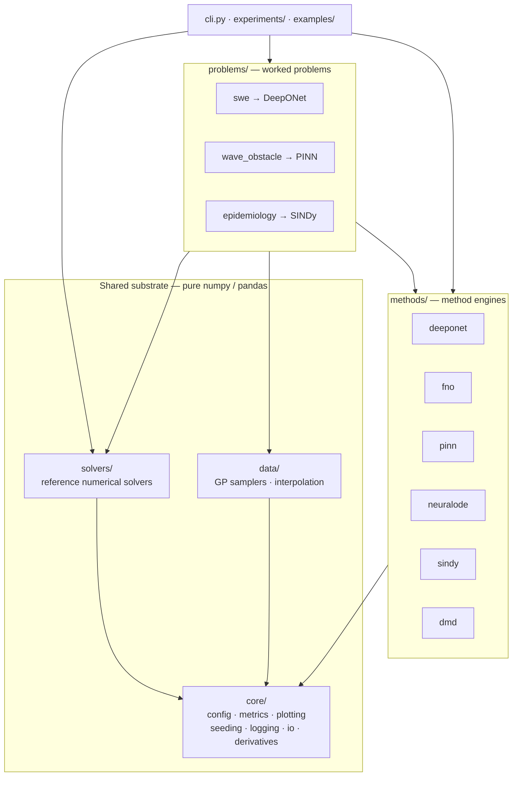
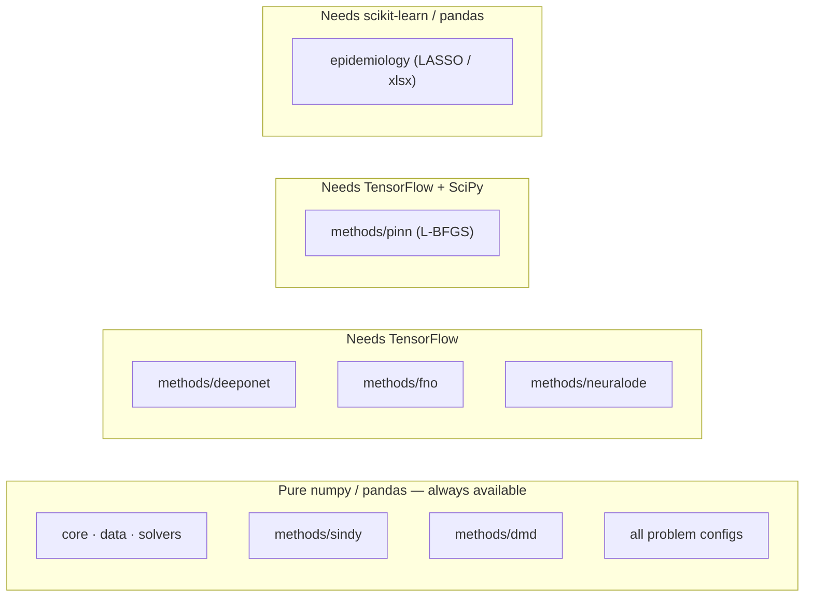
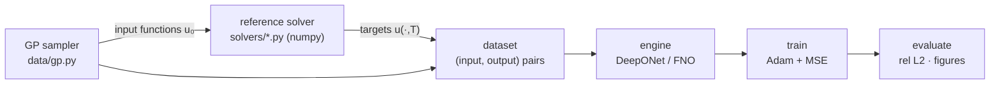
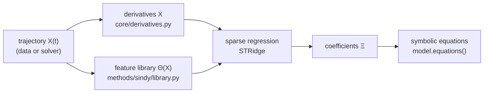
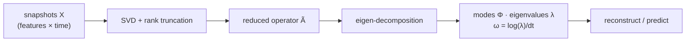
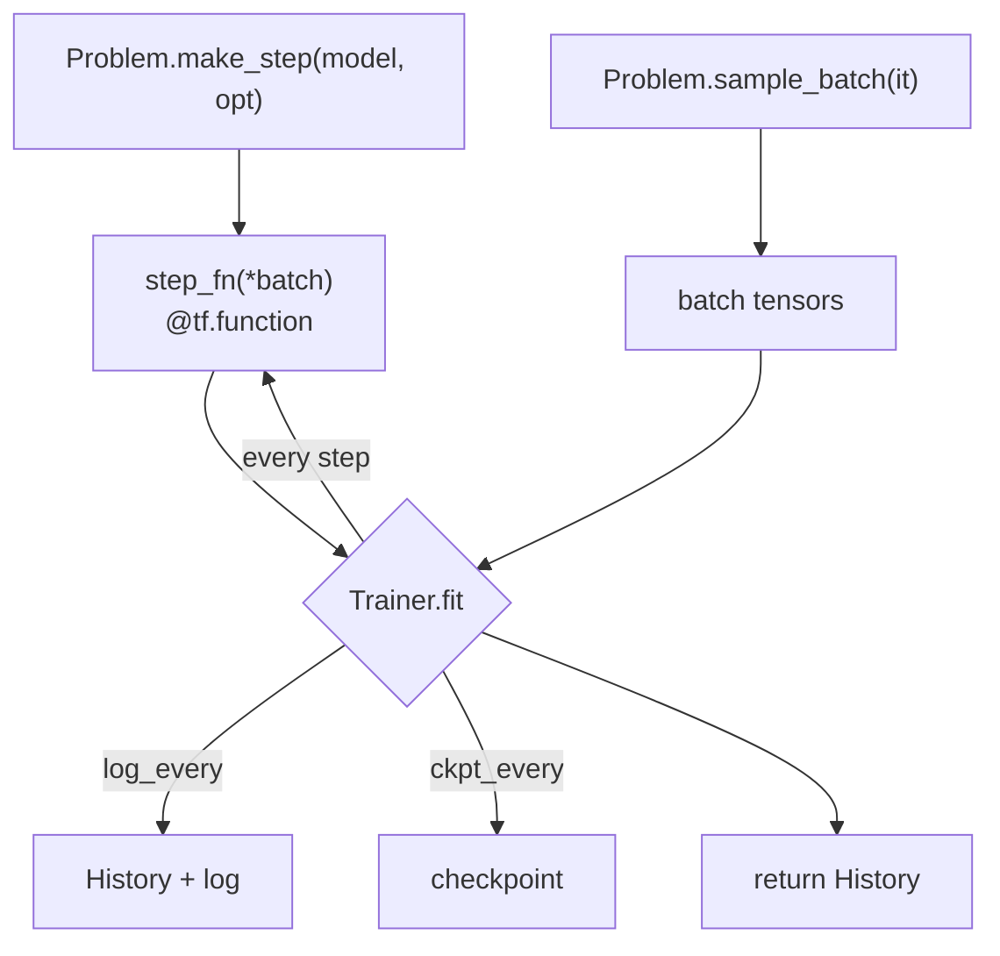
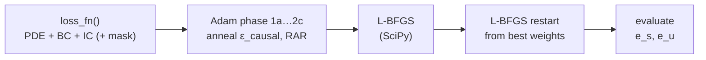
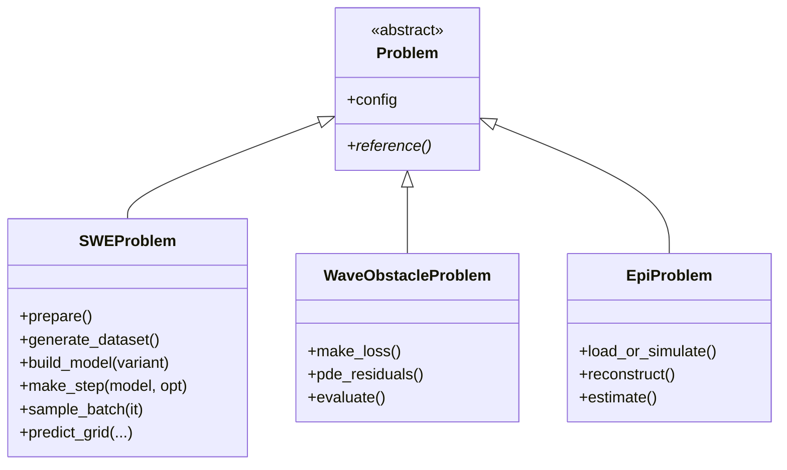

# Architecture

## Layered structure

sciml is organized as a **shared substrate**, a set of **method engines** on top
of it, **problems** that wire an engine to a specific system, and thin
**interfaces** (CLI, experiment scripts, examples) on top of those.



**Dependency rule:** arrows point *downward only*. Problems depend on engines and
the substrate; engines depend on the substrate; the substrate depends on nothing
internal. This keeps the core reusable and the coupling one-directional.

## Directory map

```
src/sciml/
├── __init__.py            # version only; imports nothing heavy
├── cli.py                 # `sciml {swe,wave,dengue}` entry point
├── tf_utils.py            # TF-only helpers (grid_interp, grad norm)
│
├── core/                  # ── pure numpy substrate ──
│   ├── config.py          # ConfigBase mixin (dict/JSON/YAML) + DomainConfig
│   ├── metrics.py         # rel_l2, rmse, abs_error, …
│   ├── derivatives.py     # Savitzky–Golay smoothing / differentiation
│   ├── plotting.py        # matplotlib paper style
│   ├── seeding.py         # seed_everything (numpy + optional TF)
│   ├── logging.py         # get_logger
│   └── io.py              # save_json / load_json
│
├── data/                  # gp.py (GP samplers), interp.py
│
├── solvers/               # ── reference solvers (numpy) ──
│   ├── swe_lax_friedrichs.py   wave_fdm.py        compartmental.py
│   ├── dynamical.py            heat.py            burgers.py
│   ├── transport.py            wave1d.py
│   ├── kuramoto_sivashinsky.py darcy.py
│
├── methods/               # ── engines ──
│   ├── deeponet/   mlp · operator (DeepONetOperator) · optim · trainer   (TF)
│   ├── fno/        spectral (Conv1D/2D) · model (build_fno1d/2d)         (TF)
│   ├── pinn/       layers · networks · gradients · training · sampling   (TF/SciPy)
│   ├── neuralode/  integrators (odeint) · model (NeuralODE)              (TF)
│   ├── sindy/      sparse (STRidge) · library · model (SINDy)            (numpy)
│   └── dmd/        dmd (exact DMD / Koopman)                             (numpy)
│
└── problems/              # ── worked problems ──
    ├── base.py            # Problem ABC
    ├── swe/               # config · cases · model · problem · physics · runners
    ├── wave_obstacle/     # config · problem · runners
    └── epidemiology/      # config · reconstruction · estimators · problem · runners

configs/       swe.yaml · wave_obstacle.yaml · dengue.yaml (+ JSON)
experiments/   swe/{train,evaluate,ablation,nd_scaling,physics_attractor} · wave_obstacle · epidemiology
examples/      01–13 graded gallery
tests/         numpy tests (always run) + TF-guarded tests
docs/          this documentation
```

## Backend strategy

Only some layers need a deep-learning backend. The split is deliberate so the
core is testable and importable anywhere.



Install only what you use: `pip install -e ".[sindy]"`, `".[deeponet]"`,
`".[pinn]"`, or `".[all]"`. `import sciml` never imports TensorFlow.

## Data flow — operator learning (DeepONet / FNO)

Learn a mapping between functions: sample input functions, solve the PDE to get
targets, train the operator, evaluate.



## Data flow — equation discovery (SINDy)

No neural network: estimate derivatives, build a candidate-term library, solve a
sparse regression, read off the equations.



## Data flow — modal analysis (DMD)



## Training — the generic loop (DeepONet)

The `Trainer` is problem-agnostic: a problem supplies a compiled `step_fn` and a
`sample_batch(iteration)` producer; the Trainer runs the loop, records history,
and checkpoints.



## Training — PINN multi-phase schedule

The PINN trainer drives Adam phases (with a causal-weight anneal and optional
adaptive resampling) followed by SciPy L-BFGS refinement.



## The `Problem` contract

A problem couples a reference solver + data to a method. `problems/base.py`
fixes only the minimum (hold a config, produce a `reference()`); each concrete
problem adds method-specific responsibilities — e.g. `SWEProblem` (DeepONet)
exposes `build_model` / `make_step` / `sample_batch`, while `EpiProblem`
(SINDy) exposes `reconstruct` / `estimate`.



## Configuration

Configs are nested `dataclasses` deriving from `core.config.ConfigBase`, which
adds `to_dict` / `from_dict` / `load` / `save`. `from_dict` recurses into nested
configs **and** lists of configs (e.g. the PINN training `phases`). Unknown keys
raise `TypeError`, so a typo in a YAML file fails loudly.

```python
from sciml.problems.swe.config import SWEConfig
cfg = SWEConfig.load("configs/swe.yaml")   # or SWEConfig() for defaults
cfg.train.n_iter = 20000
cfg.save("outputs/used_config.json")
```

Next: [methods.md](methods.md) for each engine, or [problems.md](problems.md)
for the worked studies.
