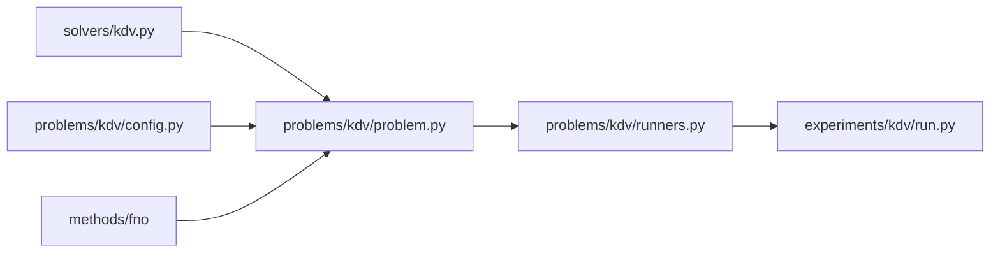

# Extending the framework

The framework is designed so that adding a system or a method touches one place.

## Add a new problem (reuse an existing engine)

Example goal: learn the **Korteweg–de Vries** operator with an FNO.

1. **Reference solver** — add `solvers/kdv.py` (pure numpy) returning the
   ground-truth field, and export it in `solvers/__init__.py`. Add a test
   (conservation / manufactured solution).

2. **Config** — add `problems/kdv/config.py` composing `core.config.ConfigBase`
   dataclasses (domain, model, train). Give every field a default.

3. **Problem** — add `problems/kdv/problem.py` wiring the solver + dataset to the
   engine (here `sciml.methods.fno.build_fno1d`). Provide a `reference()` and
   whatever the runner needs (dataset builder, predict helper).

4. **Runner + script** — add `problems/kdv/runners.py` (train/evaluate/figures)
   and a thin `experiments/kdv/run.py` that loads the config and calls it.

5. **(optional) CLI** — add a `kdv` subcommand in `cli.py`.

The substrate (`core`, `data`, `solvers`), the engine, and the `Trainer` are
reused unchanged.

## Add a new method engine

Create `methods/<name>/` as a self-contained package:

- Keep it **problem-agnostic** (no PDE specifics).
- Expose a small public API in `__init__.py`.
- If it needs a backend, import it at the top of the submodule (not in
  `methods/__init__.py`), and add an optional extra in `pyproject.toml`
  (`[project.optional-dependencies]`).
- Prefer pure numpy where feasible so it is testable everywhere (see
  `methods/sindy`, `methods/dmd`).
- Add tests: numpy engines get real tests; TF engines get
  `pytest.importorskip("tensorflow")` shape/behaviour tests.

## Conventions

- **Docstrings** on every public module/class/function (PEP 257). Coverage is
  gated at 100% by `interrogate` (see [reference.md](reference.md)).
- **Configs** are dataclasses with defaults; unknown keys must fail loudly.
- **Determinism** via `core.seeding.seed_everything`.
- **No heavy imports at package import time** — keep `import sciml` cheap.
- Line length ≈ 100; match the terse style of the surrounding code.

## Checklist for a pull request

- [ ] New code has docstrings (`interrogate src` passes at 100%).
- [ ] Numpy paths have real tests; TF paths have guarded tests.
- [ ] `pytest -q` passes; `python -m compileall src` is clean.
- [ ] New public API is documented in `docs/methods.md` or `docs/problems.md`.
- [ ] Any new dependency is an **optional** extra, not a core dependency.
