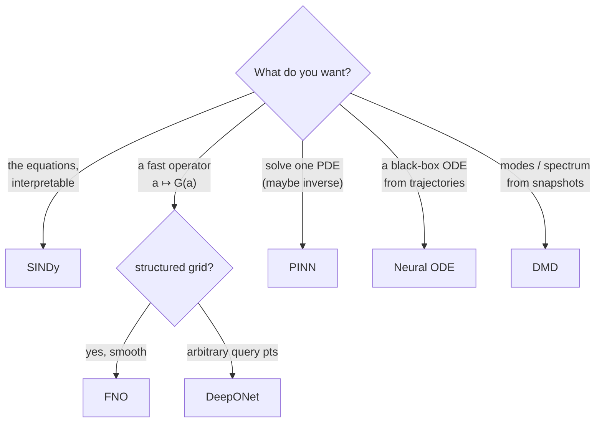

# Method engines

Each engine lives under `sciml.methods.<name>` and is **problem-agnostic**. This
page gives, per method: the idea and math, when to reach for it, the key API,
and the gallery example that exercises it.

---

## DeepONet — `sciml.methods.deeponet`

**Idea.** Learn a nonlinear *operator* `G : a ↦ G(a)` between function spaces.
A DeepONet factorizes the output as an inner product of a **branch** network
(encoding the input function `a` at fixed sensor points) and a **trunk** network
(encoding the query coordinate `y`):

```
G(a)(y) ≈ Σ_k  β_k(a) · φ_k(y)   (+ bias)
```

**When.** You have many (input-function → output-function) pairs and want a fast
surrogate that generalizes across inputs at arbitrary query points.

**API.**
```python
from sciml.methods.deeponet import DeepONetOperator, DeepONet, Trainer, make_optimizer

op = DeepONetOperator.create(n_sensors=100, n_branches=2, coord_dim=2,
                            width=64, hidden=[128,128,128])
beta  = op.coefficients([h0_sensors, b_sensors])   # (B, P)
field = op([h0_sensors, b_sensors], query_xy)      # (B, N)
```
`DeepONetOperator` supports **several summed branch nets** (feed multiple input
functions into one operator). `Trainer` is the generic injected-step loop
(see [architecture](architecture.md#training--the-generic-loop-deeponet)).

**Examples.** `08_advection_diffusion_deeponet.py`; full study: `problems/swe`.

---

## FNO — `sciml.methods.fno`

**Idea.** A Fourier Neural Operator replaces the branch/trunk factorization with
**spectral convolutions**. Each layer maps to Fourier space, keeps the lowest
`modes` frequencies, applies a learned complex linear map per mode, transforms
back, and adds a pointwise (1×1) residual:

```
v ↦ σ( 𝓕⁻¹( R · 𝓕(v) )  +  W·v )
```

**When.** Smooth PDE solution operators on regular grids; resolution-flexible and
efficient. 1D and 2D are provided.

**API.**
```python
from sciml.methods.fno import build_fno1d, build_fno2d
m1 = build_fno1d(modes=16, width=64, n_layers=4, in_channels=2, out_channels=1)  # (B,N,C)->(B,N,1)
m2 = build_fno2d(grid=29, modes=12, width=32, in_channels=3, out_channels=1)     # (B,H,W,3)->(B,H,W,1)
```
Constraint: `modes ≤ n_x//2 + 1` (1D) and `modes ≤ grid//2` (2D). Models compile
with standard Keras (`model.compile(...); model.fit(...)`).

**Examples.** `05_heat_fno.py`, `06_burgers_fno.py`, `11_darcy_fno2d.py`.

---

## PINN — `sciml.methods.pinn`

**Idea.** A physics-informed NN represents the solution `u_θ(x,t)` directly and
is trained to minimize the PDE residual plus boundary/initial conditions,
evaluated at collocation points via automatic differentiation. No labeled
solution data needed:

```
L = ‖ 𝓝[u_θ] ‖²_Ω  +  λ_bc ‖BC‖²  +  λ_ic ‖IC‖²
```

**When.** Solving a specific PDE (forward or inverse), especially with free
boundaries or where meshing is awkward.

**API.**
```python
from sciml.methods.pinn import build_mlp, derivatives_2d, PINNTrainer, causal_weight
net = build_mlp(2, hidden=4, width=64, out_dim=1, fourier_freq=16)   # u(x,t)
d = derivatives_2d(net, xt)     # {u, u_x, u_t, u_xx, u_tt}
trainer = PINNTrainer(net.trainable_variables, loss_fn)
trainer.run_adam(8000, 1e-3, on_step=schedule)   # multi-phase-friendly
trainer.run_lbfgs(6000, restart_from_best=True)  # SciPy refinement
```
Helpers: `FourierEmbedding`/`ScaledSigmoid` layers, `beta_max_sampling` and
`replace_high_residual` for RAR, `causal_weight` for time-causal annealing.

**Examples.** `09_wave1d_pinn.py`; full study: `problems/wave_obstacle`.

---

## Neural ODE — `sciml.methods.neuralode`

**Idea.** Model dynamics as a learned vector field and integrate it:

```
dy/dt = f_θ(t, y),   y(t) = y₀ + ∫ f_θ dt
```

A fixed-step differentiable solver unrolls the trajectory; gradients flow through
the integration.

**When.** Learning a *black-box* dynamical model from trajectories (contrast with
SINDy, which returns symbolic equations).

**API.**
```python
from sciml.methods.neuralode import NeuralODE, build_odefunc, odeint
node = NeuralODE(build_odefunc(state_dim=2, hidden=(64,64)))
traj = node(y0, t)                        # (len(t), B, d)
hist = node.fit_trajectory(y0, t, target, steps=600, lr=1e-2)
```

**Example.** `07_lotka_volterra_neural_ode.py`.

---

## SINDy — `sciml.methods.sindy`

**Idea.** Sparse Identification of Nonlinear Dynamics. Assume the dynamics are a
sparse combination of candidate terms `Θ(X)` and solve for the coefficients with
a sparsity-promoting regression:

```
Ẋ ≈ Θ(X) · Ξ ,   Ξ sparse   (Sequential Thresholded Ridge)
```

**When.** You want the *governing equations themselves* (interpretable, symbolic)
from data. Pure numpy — no backend.

**API.**
```python
from sciml.methods.sindy import SINDy, PolynomialLibrary, FourierLibrary, stridge
model = SINDy(PolynomialLibrary(degree=2), threshold=0.1).fit(X, t=t, input_names=["x","y","z"])
print(model.equations(["x'","y'","z'"]))   # symbolic result
```
Libraries compose: `PolynomialLibrary(3) + FourierLibrary(2, period=52)`.
`stridge(Θ, y, threshold, alpha)` is the standalone sparse solver;
`windowed_coefficients(...)` fits per sliding window (time-varying coefficients).

**Examples.** `01, 03, 04, 12, 13`; full study: `problems/epidemiology`.

---

## DMD / Koopman — `sciml.methods.dmd`

**Idea.** Dynamic Mode Decomposition finds the best-fit linear operator
`x_{k+1} ≈ A x_k` from snapshots, then diagonalizes it into spatial **modes**
with exponential temporal dynamics:

```
X ≈ Φ · diag(exp(ω t)) · b ,   ω = log(λ)/dt
```

**When.** Extract coherent structures / a growth-and-frequency spectrum from
spatiotemporal data, or build a cheap linear predictor. Pure numpy.

**API.**
```python
from sciml.methods.dmd import DMD
dmd = DMD(rank=8).fit(X, dt=0.1)           # X: (n_features, n_time)
dmd.eigenvalues, dmd.omega, dmd.modes, dmd.amplitudes
recon = dmd.reconstruct(n_time)            # or dmd.predict(t)
```

**Examples.** `02_harmonic_oscillator_dmd.py`, `10_kuramoto_sivashinsky_dmd.py`.

---

## Choosing a method



See [problems.md](problems.md) for how these plug into the worked studies.
