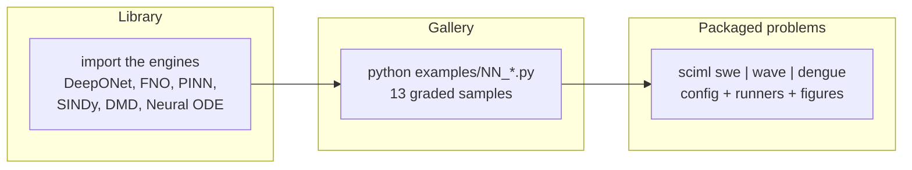

# Overview

## What this project is

**sciml** is a compact research framework for **scientific machine learning**:
learning and identifying the mathematics of physical systems from data. It
brings six method families under one roof, over a shared, backend-light core:

| Family | Idea | Engine |
|---|---|---|
| **DeepONet** | learn a solution *operator* `a ↦ G(a)` | `sciml.methods.deeponet` |
| **FNO** | learn an operator via spectral convolutions | `sciml.methods.fno` |
| **PINN** | solve a PDE by minimizing its residual with an NN | `sciml.methods.pinn` |
| **Neural ODE** | learn continuous-time dynamics `dy/dt = f_θ(y)` | `sciml.methods.neuralode` |
| **SINDy** | identify governing equations by sparse regression | `sciml.methods.sindy` |
| **DMD / Koopman** | extract linear modes/spectrum from snapshots | `sciml.methods.dmd` |

Each family is demonstrated on a worked problem refactored from a research
notebook, and on a graded gallery of smaller samples.

## Where it came from

The framework is the consolidation of three notebooks into one maintainable
package:

- `pi_deeponet_swe_v6` → DeepONet for the **1D Shallow Water Equations**
- `pinn_string_obstacle_original_v4` → PINN for a **moving-boundary wave**
- `dengue_beta_estimation` → SINDy for **dengue β(t) identification**

FNO, Neural ODE and DMD were then added as peer engines, plus a 13-example
gallery balanced across ODE and PDE problems.

## Design philosophy

1. **Generic engines, pluggable problems.** A method engine knows nothing about
   any specific PDE. A *problem* wires a reference solver + data to an engine.
   Adding a system means writing one module, not forking the framework.

2. **Backend-light core.** Everything in `core/`, `data/`, `solvers/`, every
   example *config*, and the entire **SINDy** and **DMD** path is pure
   numpy/pandas — it imports and runs with no deep-learning backend. TensorFlow
   (DeepONet, PINN, FNO, Neural ODE) and SciPy (PINN L-BFGS) are **optional
   extras**, imported lazily so `import sciml` stays cheap.

3. **Everything is verifiable.** Pure-numpy paths have real tests (SINDy
   *recovers* Lorenz/Van-der-Pol/FitzHugh–Nagumo from data; DMD recovers an
   operator's spectrum; the Darcy solver matches a manufactured solution).
   TensorFlow paths have shape/behaviour tests that skip cleanly when TF is
   absent.

4. **Config-driven and reproducible.** Experiments are described by dataclass
   configs (YAML/JSON), with global seeding.

## The three ways to use it

- **As a library** — import engines (`from sciml.methods.sindy import SINDy`)
  and use them on your own data.
- **Via the gallery** — run `examples/01…13` to learn the API progressively.
- **Via the packaged problems** — `sciml swe`, `sciml wave`, `sciml dengue`
  (or the `experiments/` scripts) for the full, config-driven studies.

Continue to [architecture.md](architecture.md) for the structure and flowcharts.
